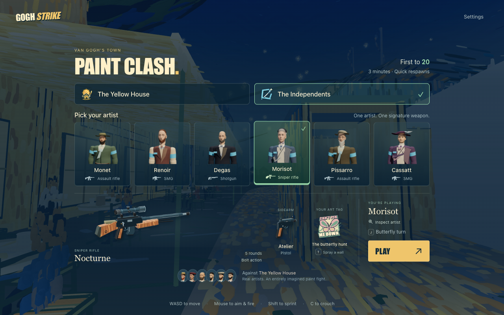

# 고흐 스트라이크

**12명의 화가. 두 개의 라이벌 크루. 한 번의 페인트 대전.**

반 고흐 마을을 배경으로 한, 회화적인 6 vs 6 브라우저 슈터입니다. 화가를 골라 시그니처 무기를 들고, 카페 거리를 3분짜리 라이벌전이 가득한 격전장으로 바꿔보세요.

### [🎮 고흐 스트라이크 플레이하기 →](https://gogh-strike.surge.sh/)

[ChatGPT Sites](https://gogh-strike.petergostev.chatgpt.site/)에서도 플레이할 수 있습니다.

설치 불필요 · 데스크탑 키보드와 마우스 · 봇과의 1인 모드


5명의 봇과 함께 라이벌 크루에 맞서세요. 먼저 **20킬**을 달성하거나, **3분** 경과 후 더 높은 점수를 가진 쪽이 승리합니다. 2초 리스폰으로 끊김 없이 전투를 이어가세요. 질주, 슬라이드, 페인트 폭발, 그리고 벽에 화가의 시그니처 태그를 남겨보세요.

## 화가를 선택하세요

**노란 집** 또는 **인디펜던츠** 중 한 크루에 합류하세요. 각 화가는 자신만의 시그니처 주무기, 권총, 아트 태그, 승리 춤을 갖추고 있습니다. 마음에 드는 화가를 고르고 **플레이**를 누르세요 — 짧은 3-2-1 카운트다운 동안 주변을 둘러볼 수 있습니다.



## 화가들을 만나보세요

**화가 점검**으로 한 걸음 더 가까이서 살펴보세요. 스튜디오는 게임에서 만나는 것과 동일한 모델을 사용하며, 얼굴, 전신, 걷기, 앉기 자세를 모두 확인할 수 있습니다.

<p align="center">
  
</p>

| 무기 | 노란 집 | 인디펜던츠 |
| --- | --- | --- |
| 프로방스 돌격소총 | 반 고흐, 시냐크 | 모네, 피사로 |
| 미스트랄 기관단총 | 고갱, 루트레크 | 르누아르, 카사트 |
| 하베스터 산탄총 | 세잔 | 드가 |
| 노튀르 정밀 소총 | 쇠라 | 모리소 |

12명 모두 각자의 체형, 얼굴, 의상, 이동 무게, 그래피티, 춤이 다릅니다. 화가들은 실존 인물이며, 크루·무기·의상·라이벌 관계는 모두 상상입니다. 체형은 캐릭터 디자인의 해석이며, 실측된 자료가 아닙니다. 자세한 자료는 [아트 월드 가이드](docs/ART-WORLD.md), [화가 노트](docs/characters/), [태그 가이드](docs/ARTIST-TAGS.md)를 참고하세요.

## 조작법

| 입력 | 동작 |
| --- | --- |
| W / A / S / D; 마우스 | 이동; 시점 |
| 좌클릭; 우클릭 꾹 | 발사; 정조준 |
| Shift + 전진; Space | 질주; 점프 |
| C 또는 Ctrl 꾹 | 앉기; 질주 중 앉기로 슬라이드 |
| R; 1 / 2 또는 마우스 휠 | 재장전; 주무기/권총 전환 |
| B; I; V | 발사 모드 선택; 무기 점검; 근접 공격 |
| Q / G; H 꾹 (정지 중) | 연막 / 페인트 폭발; 회복 |
| T; J | 아트 태그 스프레이; 승리 춤 |
| Tab 꾹; Esc | 점수표; 일시정지 / 재개 |

앉기는 실제 탄퍼짐과 조준선 모두를 좁힙니다. 질주와 슬라이드 중에는 발사할 수 없습니다. 아군은 총알을 막아주지만 아군 데미지를 입지 않습니다. 자신의 페인트 폭발에는 자신이 데미지를 입습니다. 발사 및 기타 공격 동작은 스폰 보호를 해제합니다.

리스폰 시 표시 체력 100과 방어구 50으로 시작합니다. 처치 시 최대 10의 체력이 회복되며, 데미지를 받지 않은 채 4.5초가 지나면 체력이 재생합니다. 각 화가는 주무기 1정과 권총 1정을 가지고 있으며, 무기·탄약·유틸리티 충전은 리스폰 시 모두 채워집니다.

설정에서 감도, 볼륨, 브러시워크 품질을 조절할 수 있습니다. 다른 앱으로 전환하면 매치가 일시정지되고 입력은 초기화됩니다. 브라우저가 마우스를 놓으면 다시 캡처하라는 안내가 표시되며, 그 안내를 클릭하면 다시 잡힙니다. 모바일 터치 컨트롤과 온라인 멀티플레이어는 구현되어 있지 않습니다 — 이 게임은 봇을 상대하는 1인용 게임입니다.

## 로컬에서 플레이

Node.js 20+와 하드웨어 가속 WebGL을 지원하는 데스크탑 브라우저, 키보드, 마우스가 필요합니다.

```sh
git clone https://github.com/petergpt/gogh-strike.git
cd gogh-strike
npm start
```

**http://127.0.0.1:8967/** 을 여세요. 런타임과 모델이 함께 번들되어 있어 별도의 의존성 설치 없이 플레이할 수 있습니다. 다른 포트가 필요하면 `PORT=8968 npm start` 를 사용하세요. 첫 온라인 로드는 약 36MB의 게임 자산을 다운로드하며, 이후 방문에서는 브라우저 캐시를 재사용할 수 있습니다.

## 개발 및 배포

```sh
npm ci
npm test
npm run build
```

`dist/`는 Surge 또는 다른 정적 호스팅에 그대로 올릴 수 있는 단독 정적 사이트입니다. 빌드 결과물에는 브라우저 파일과 라이선스 고지만 포함되며, 개발 도구와 원본 소스 장면은 제외됩니다. 본인 Surge 계정으로 게시하려면:

```sh
surge dist https://your-game.surge.sh
```

[개발 노트](docs/DEVELOPMENT.md)에서 아키텍처와 캐릭터 도구를 확인할 수 있습니다. 사전 빌드된 GLB 모델과 초상화가 저장소에 함께 들어 있습니다. Blender 빌더와 공식 CC0 해부학 소스도 포함되어 있어 모델과 편집 가능한 `.blend` 씬을 직접 재생성할 수 있습니다. 게임 실행에는 Blender가 필요하지 않습니다.

ChatGPT Sites용으로는 기존 `.openai/hosting.json` 이 정적 `dist/` 빌드를 선택합니다. 본인 포크를 게시할 때는 그 안의 `project_id` 를 제거하여 Sites가 별도의 사이트를 만들도록 하세요.

## 라이선스 및 소스

원본 코드와 아트워크는 [MIT 라이선스](LICENSE)입니다. Three.js의 MIT 고지가 유지되며, MakeHuman의 해부학 베이스와 모프 타깃은 CC0입니다. [제3자 고지](THIRD_PARTY_NOTICES.md) 및 [출처](PROVENANCE.md)를 참고하세요.

---

🇰🇷 **이 저장소는 [petergpt/gogh-strike](https://github.com/petergpt/gogh-strike)의 한글화 버전입니다.** 원본은 MIT 라이선스로 배포되며, 본 저장소는 원본 코드와 자산을 그대로 유지한 채 한국어로 번역된 UI/문서만 포함합니다.

### 한글화 범위

- ✅ **UI 전면 한글화**: 메뉴, HUD, 모달, 점수표, 설정, 일시정지, 결과 화면, 툴팁, 알림
- ✅ **게임플레이 텍스트**: 무기 이름/설명, 화가 도발, 아트 태그 텍스트, 봇 라디오 호출
- ✅ **캐릭터 스튜디오**: 모드 레이블, 탐색 버튼, 시점 라벨, 도움말
- ✅ **README**: 설치, 플레이, 개발, 배포 가이드 전부 한글로 다시 작성
- ✅ **HTML 자산 경로**: Pages subpath 호환을 위해 `/vendor/...` → `./vendor/...` 변경
- ✅ **식별자 보존**: role 이름 (`vanguard`/`flanker`/...), 게임 로직 ID, CSS 클래스는 영문 그대로 유지

### 라이브 데모

라이브 데모 : https://sigco3111.github.io/gogh-strike/

[](https://sigco3111.github.io/gogh-strike/)
